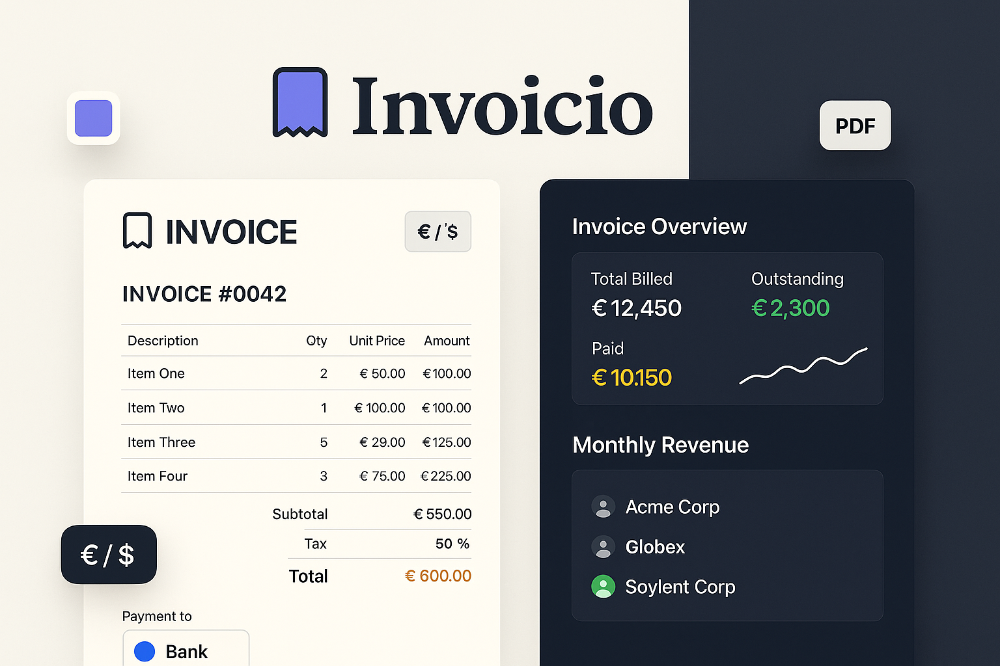

<div align="center">
  
</div>

<div align="center">

# Invoicio

**A fully browser-based invoice builder — create, customise, export, and manage professional invoices without a backend.**

[](https://vuejs.org)
[](https://vitejs.dev)
[](https://ekoopmans.github.io/html2pdf.js/)
[](LICENSE)

</div>

---

## What Is This?

Invoicio is a **zero-backend invoice management app** built with Vue 3 and Vite. Everything runs in the browser — no server, no database, no subscriptions. Build a polished invoice in minutes, export it as a PDF, and save your data as a portable JSON file you can reload any time.

It ships with a full dashboard, client database, item catalogue, invoice history, and even email templates — all local-first and privacy-friendly.

### Key Highlights

- **Complete invoice builder** — invoice number, dates, sender/recipient details, logo upload, accent colour and currency picker
- **Line items engine** — add unlimited items with description, quantity, unit price, and per-item or total-level tax
- **Auto-calculations** — subtotal, tax, discounts, and grand total update in real time
- **Multiple payment methods** — bank transfer, PayPal, credit card, cash, or custom
- **PDF export** — one-click export via `html2pdf.js` with a clean print-ready template
- **Client database** — save and reuse client details across invoices
- **Invoice history** — browse, reload, and manage past invoices locally
- **Item catalogue** — save your products/services and insert them in one click
- **Email templates** — pre-written templates to send alongside your invoice
- **Save / Load** — export the full invoice as JSON; reimport it any time
- **Settings export** — serialise your preferences (currency, colours, date format) separately
- **Responsive** — works on desktop and mobile

---

## Tech Stack

| Layer | Technology |
|-------|-----------|
| Framework | Vue 3 (Composition API) |
| Build Tool | Vite 5 |
| PDF Export | html2pdf.js |
| Compression | pako |
| Styling | Scoped CSS (no UI library) |
| Runtime | Browser-only, zero backend |

---

## Getting Started

### Prerequisites

- Node.js 16+
- npm, yarn, or bun

### Installation

```bash
git clone https://github.com/mariojgt/invoicio.git
cd invoicio
npm install
```

### Development

```bash
npm run dev
```

Open `http://localhost:5173` in your browser.

### Production Build

```bash
npm run build
npm run preview
```

Built output lands in `dist/`.

---

## Deploying to GitHub Pages

A GitHub Actions workflow can automate deployment:

```yaml
name: Deploy to GitHub Pages

on:
  push:
    branches: ['main']

jobs:
  build-and-deploy:
    runs-on: ubuntu-latest
    steps:
      - uses: actions/checkout@v4

      - name: Setup Node
        uses: actions/setup-node@v4
        with:
          node-version: '20'

      - name: Install dependencies
        run: npm ci

      - name: Build
        run: npm run build

      - name: Deploy to GitHub Pages
        uses: peaceiris/actions-gh-pages@v3
        with:
          github_token: ${{ secrets.GITHUB_TOKEN }}
          publish_dir: ./dist
```

---

## Usage

### Creating an Invoice

1. **Logo** — click the upload area to add your company logo
2. **Invoice Details** — set invoice number, issue date, and due date
3. **From / To** — enter your company details and the client's information
4. **Items** — add line items with description, quantity, and unit price
5. **Tax** — choose *per-item* or *on-total* tax mode and set rates
6. **Payment** — select a payment method and fill in the details
7. **Notes** — add terms, conditions, or a personal message

### Tax Modes

| Mode | Behaviour |
|------|-----------|
| Per Item | Each line item carries its own tax rate |
| On Total | A single rate applies to the whole subtotal |

### Saving & Loading

| Action | How |
|--------|-----|
| Save invoice | Click **Save** → downloads as `.json` |
| Load invoice | Click **Load** → pick a previously saved `.json` |
| Save settings | Export just your preferences (currency, colour, date format) |
| Load settings | Import preferences from a saved settings file |

### Printing / PDF Export

Click **Print** to open the browser print dialog — or use the PDF export button for a direct download via `html2pdf.js`.

---

## Project Structure

```
invoicio/
├── public/
│   └── favicon.svg
├── src/
│   ├── components/
│   │   ├── Dashboard.vue          # Main dashboard overview
│   │   ├── InvoiceDetails.vue     # Invoice number, dates
│   │   ├── InvoiceParties.vue     # Sender & recipient info
│   │   ├── InvoiceItems.vue       # Line items table
│   │   ├── InvoicePayment.vue     # Payment method selector
│   │   ├── InvoicePreview.vue     # Live invoice preview
│   │   ├── InvoiceDisplay.vue     # Read-only display view
│   │   ├── InvoiceHistory.vue     # Saved invoice browser
│   │   ├── ClientDatabase.vue     # Client address book
│   │   ├── ClientPortal.vue       # Client-facing portal view
│   │   ├── ItemCatalog.vue        # Reusable product/service list
│   │   ├── EmailTemplates.vue     # Email template manager
│   │   ├── PdfTemplate.vue        # Print/PDF layout
│   │   ├── SettingsPanel.vue      # App preferences
│   │   ├── AppHeader.vue
│   │   └── AppFooter.vue
│   ├── composables/               # Vue composables (shared logic)
│   ├── styles/
│   │   └── main.css
│   ├── App.vue
│   └── main.js
├── index.html
├── package.json
├── vite.config.js
└── README.md
```

---

## License

MIT — free for personal and commercial use.
