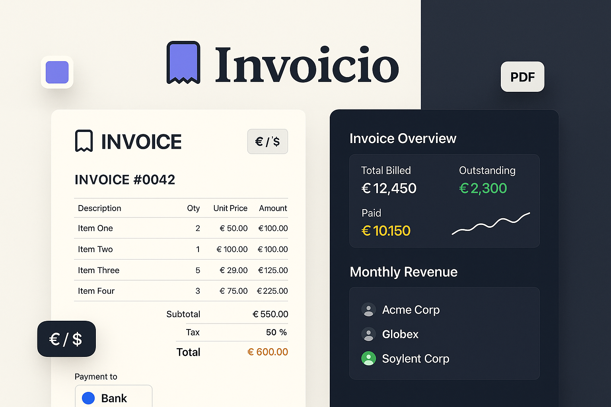

<div align="center">
  
</div>

<div align="center">

# Invoicio

**A fully browser-based invoice builder — create, customise, export, and manage professional invoices without a backend.**

[](https://vuejs.org)
[](https://vitejs.dev)
[](https://ekoopmans.github.io/html2pdf.js/)
[](LICENSE)

</div>

---

## What Is This?

Invoicio is a **self-hostable invoice management app** built with Vue 3 and Vite. Build a polished invoice in minutes, export it as a PDF, and keep your invoices in your own SQLite database — behind a login screen, in a single Docker container, on your own hardware.

It ships with a full dashboard, client database, item catalogue, invoice history, email templates, and an **MCP endpoint** so AI assistants (Claude Code, Claude Desktop, etc.) can create, edit, and view invoices for you.

### Key Highlights

- **Self-hosted** — one Docker container, SQLite storage, simple login screen
- **MCP tools** — let your AI assistant create, edit, view, list, and delete invoices
- **Complete invoice builder** — invoice number, dates, sender/recipient details, logo upload, accent colour and currency picker
- **Line items engine** — add unlimited items with description, quantity, unit price, and per-item or total-level tax
- **Auto-calculations** — subtotal, tax, discounts, and grand total update in real time
- **Multiple payment methods** — bank transfer, PayPal, credit card, cash, or custom
- **PDF export** — one-click export via `html2pdf.js` with a clean print-ready template
- **Client database** — save and reuse client details across invoices
- **Invoice history** — browse, reload, and manage past invoices locally
- **Item catalogue** — save your products/services and insert them in one click
- **Email templates** — pre-written templates to send alongside your invoice
- **Save / Load** — export the full invoice as JSON; reimport it any time
- **Settings export** — serialise your preferences (currency, colours, date format) separately
- **Responsive** — works on desktop and mobile

---

## Tech Stack

| Layer | Technology |
|-------|-----------|
| Framework | Vue 3 (Composition API) |
| Build Tool | Vite 5 |
| Backend | Express + built-in `node:sqlite` (Node 24) |
| Auth | Session cookie (HMAC-signed), credentials via env vars |
| MCP | `@modelcontextprotocol/sdk` — Streamable HTTP at `/mcp` |
| PDF Export | html2pdf.js |
| Compression | pako |
| Styling | Scoped CSS (no UI library) |
| Deployment | Single Docker container, SQLite volume |

---

## Self-Hosting with Docker (Recommended)

Everything — the web app, the API, the SQLite database, and the MCP endpoint — runs in one container.

```bash
git clone https://github.com/mariojgt/invoicio.git
cd invoicio
cp .env.example .env       # then edit: set AUTH_PASSWORD, SESSION_SECRET, MCP_TOKEN
docker compose up -d --build
```

Open `http://localhost:8080` and sign in.

### Environment Variables

| Variable | Default | Purpose |
|----------|---------|---------|
| `AUTH_USERNAME` | `admin` | Web UI login username |
| `AUTH_PASSWORD` | `invoicio` | Web UI login password — **change this!** |
| `SESSION_SECRET` | random per boot | Signs session cookies; set it so logins survive restarts (`openssl rand -hex 32`) |
| `MCP_TOKEN` | *(empty = MCP disabled)* | Bearer token for the `/mcp` endpoint |
| `HOST_PORT` | `8080` | Host port docker-compose publishes |
| `DATA_DIR` | `/app/data` | Where the SQLite database lives (mounted as a volume) |

Invoices are stored in SQLite inside the `invoicio-data` volume, so they survive container rebuilds and restarts. Settings, clients, and the item catalogue remain in the browser's localStorage.

> **Note:** the login cookie is not marked `Secure` by default — put the container behind an HTTPS reverse proxy (Caddy, Traefik, nginx) before exposing it to the internet.

---

## MCP Tools (AI-Assisted Invoicing)

With `MCP_TOKEN` set, the container exposes an MCP server (Streamable HTTP) at `/mcp` with these tools:

| Tool | Description |
|------|-------------|
| `create_invoice` | Create and save a new invoice (totals computed automatically) |
| `update_invoice` | Edit any field of an existing invoice |
| `get_invoice` | View the full contents of one invoice |
| `list_invoices` | List invoice summaries, optionally filtered by status |
| `delete_invoice` | Permanently remove an invoice |

Connect it to Claude Code:

```bash
claude mcp add --transport http invoicio http://localhost:8080/mcp \
  --header "Authorization: Bearer YOUR_MCP_TOKEN"
```

Then just ask: *"Create an invoice for ACME Corp — 10 hours of consulting at €95/h, due at the end of next month."* New invoices show up in the web UI's invoice history.

---

## Getting Started (Local Development)

### Prerequisites

- Node.js 22.13+ (the backend uses the built-in `node:sqlite` module)
- npm, yarn, or bun

### Installation

```bash
git clone https://github.com/mariojgt/invoicio.git
cd invoicio
npm install
```

### Development

Run the API server and the Vite dev server (which proxies `/api` and `/mcp`):

```bash
npm run dev:server    # API on http://localhost:3001
npm run dev           # UI on http://localhost:5173
```

Default dev credentials are `admin` / `invoicio` (override with `AUTH_USERNAME` / `AUTH_PASSWORD`).

### Production Build (without Docker)

```bash
npm run build
AUTH_PASSWORD=secret MCP_TOKEN=$(openssl rand -hex 32) npm start
```

`npm start` serves the built `dist/` and the API from a single process (port `3001`, override with `PORT`).

---

## Deploying to GitHub Pages

A GitHub Actions workflow can automate deployment:

```yaml
name: Deploy to GitHub Pages

on:
  push:
    branches: ['main']

jobs:
  build-and-deploy:
    runs-on: ubuntu-latest
    steps:
      - uses: actions/checkout@v4

      - name: Setup Node
        uses: actions/setup-node@v4
        with:
          node-version: '20'

      - name: Install dependencies
        run: npm ci

      - name: Build
        run: npm run build

      - name: Deploy to GitHub Pages
        uses: peaceiris/actions-gh-pages@v3
        with:
          github_token: ${{ secrets.GITHUB_TOKEN }}
          publish_dir: ./dist
```

---

## Usage

### Creating an Invoice

1. **Logo** — click the upload area to add your company logo
2. **Invoice Details** — set invoice number, issue date, and due date
3. **From / To** — enter your company details and the client's information
4. **Items** — add line items with description, quantity, and unit price
5. **Tax** — choose *per-item* or *on-total* tax mode and set rates
6. **Payment** — select a payment method and fill in the details
7. **Notes** — add terms, conditions, or a personal message

### Tax Modes

| Mode | Behaviour |
|------|-----------|
| Per Item | Each line item carries its own tax rate |
| On Total | A single rate applies to the whole subtotal |

### Saving & Loading

| Action | How |
|--------|-----|
| Save invoice | Click **Save** → downloads as `.json` |
| Load invoice | Click **Load** → pick a previously saved `.json` |
| Save settings | Export just your preferences (currency, colour, date format) |
| Load settings | Import preferences from a saved settings file |

### Printing / PDF Export

Click **Print** to open the browser print dialog — or use the PDF export button for a direct download via `html2pdf.js`.

---

## Project Structure

```
invoicio/
├── server/
│   ├── index.js               # Express app: static files + invoice API
│   ├── auth.js                # Login, session cookies, rate limiting
│   ├── db.js                  # SQLite storage (node:sqlite)
│   └── mcp.js                 # MCP server + tools at /mcp
├── Dockerfile                 # Multi-stage build → single runtime image
├── docker-compose.yml
├── public/
│   └── favicon.svg
├── src/
│   ├── components/
│   │   ├── Dashboard.vue          # Main dashboard overview
│   │   ├── InvoiceDetails.vue     # Invoice number, dates
│   │   ├── InvoiceParties.vue     # Sender & recipient info
│   │   ├── InvoiceItems.vue       # Line items table
│   │   ├── InvoicePayment.vue     # Payment method selector
│   │   ├── InvoicePreview.vue     # Live invoice preview
│   │   ├── InvoiceDisplay.vue     # Read-only display view
│   │   ├── InvoiceHistory.vue     # Saved invoice browser
│   │   ├── ClientDatabase.vue     # Client address book
│   │   ├── ClientPortal.vue       # Client-facing portal view
│   │   ├── ItemCatalog.vue        # Reusable product/service list
│   │   ├── EmailTemplates.vue     # Email template manager
│   │   ├── PdfTemplate.vue        # Print/PDF layout
│   │   ├── SettingsPanel.vue      # App preferences
│   │   ├── LoginScreen.vue        # Sign-in screen
│   │   ├── AppHeader.vue
│   │   └── AppFooter.vue
│   ├── composables/               # Vue composables (shared logic)
│   ├── styles/
│   │   └── main.css
│   ├── App.vue
│   └── main.js
├── index.html
├── package.json
├── vite.config.js
└── README.md
```

---

## License

MIT — free for personal and commercial use.
